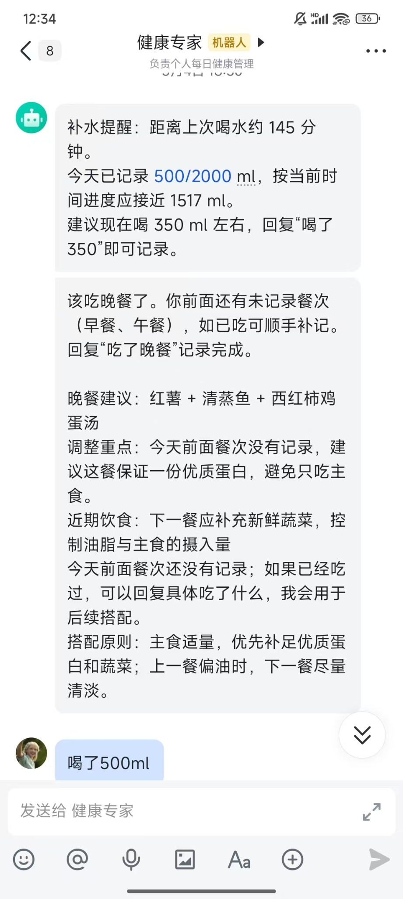
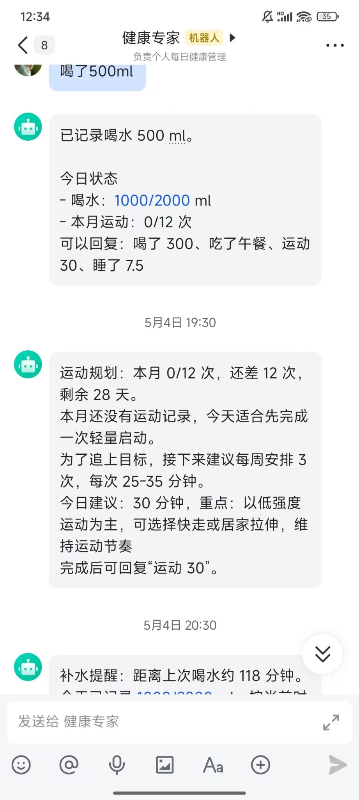
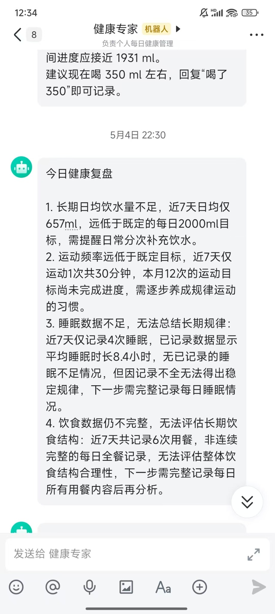

# LifePilot

A small server-side health reminder assistant for Feishu/Lark chat.

## Features

- Water reminders and daily intake tracking
- Meal reminders with balanced menu suggestions
- Sleep reminders
- Monthly exercise goal tracking
- Dynamic water reminders based on last drink time and daily progress
- Daily health memory summaries for habit pattern tracking
- Feishu bot callback endpoint for chat commands
- Scheduled proactive reminders

## Demo

LifePilot works directly in Feishu/Lark chat: it sends proactive reminders,
understands natural-language updates, tracks daily progress, and summarizes
recent habits for review.

<p align="center">
  
  
  
</p>

<p align="center">
  <sub>Proactive reminders · Natural-language tracking · Daily habit review</sub>
</p>

## Quick Start

```bash
cp .env.example .env
python -m venv .venv
. .venv/bin/activate
pip install -r requirements.txt
./scripts/start-no-proxy.sh
```

`scripts/start-no-proxy.sh` clears proxy-related environment variables for this service only.
This keeps shell-level proxy settings available for tools that need them while allowing the
Feishu bot to connect directly.

## Feishu Setup

Create a Feishu custom app with Bot capability enabled.

HTTP callback mode:

- Event subscription request URL: `https://your-domain.com/feishu/events`
- Subscribe to `im.message.receive_v1`
- Enable permissions for receiving bot chat messages and sending messages
- Set `FEISHU_APP_ID` and `FEISHU_APP_SECRET` in `.env`

Long connection mode:

- Set event subscription mode to long connection in Feishu Open Platform
- Subscribe to `im.message.receive_v1`
- Set `FEISHU_EVENT_MODE=websocket`
- Start this service; it will launch the official Feishu SDK WebSocket client during startup

For scheduled proactive reminders, set:

- `FEISHU_DEFAULT_RECEIVE_ID`: your `open_id`, `user_id`, or `chat_id`
- `FEISHU_DEFAULT_RECEIVE_ID_TYPE`: one of `open_id`, `user_id`, `chat_id`

Water reminders run as frequent checks. A reminder is only sent when the user is behind the expected daily water progress and has not logged water recently.

Daily memory summaries run at `HEALTH_MEMORY_SUMMARY_TIME` and store recent habit patterns in SQLite for future LLM context.

## Chat Commands

Examples:

```text
喝了 300
喝水
吃了早餐
今日菜单
睡了 7.5
运动 30
今日状态
```

The primary message flow is now LLM-driven:

1. The model parses the user message into structured health actions.
2. The server executes only supported local tools, such as recording water, meals, sleep, exercise, querying status, or getting a menu.
3. The model generates the final reply using the execution results and recent conversation context.

Rule-based parsing is kept as a fallback when the LLM is unavailable.

## LLM Setup

The assistant can use an OpenAI-compatible chat completions API for natural-language health coaching. Rule-based commands still run locally first; the LLM is used when a message does not match a command.

For Qwen Bailian:

```env
LLM_ENABLED=true
LLM_API_KEY=your_dashscope_api_key
LLM_BASE_URL=https://dashscope.aliyuncs.com/compatible-mode/v1
LLM_MODEL=qwen-plus
LLM_API_STYLE=chat_completions
```

For Doubao Ark, use the Base URL and model or endpoint name from your Volcengine Ark console:

```env
LLM_ENABLED=true
LLM_API_KEY=your_ark_api_key
LLM_BASE_URL=https://ark.cn-beijing.volces.com/api/v3
LLM_MODEL=your_doubao_endpoint_or_model
LLM_API_STYLE=responses
```

Conversation context is stored in SQLite and limited by `LLM_CONTEXT_LIMIT`.

## Notes

This is an MVP. Health suggestions are general habit reminders, not medical advice.
